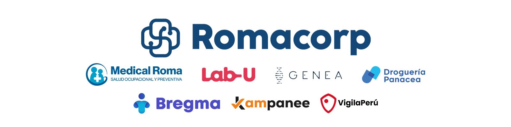
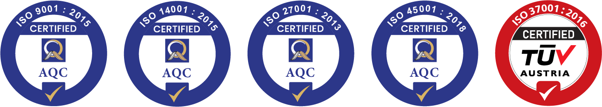

# ROMACORP - Soluciones Innovadoras en Salud y Tecnología

ROMACORP (MEDICAL CARE SERVICES S.A.C.) es un conglomerado innovador que integra diversas empresas en los sectores de la salud y la tecnología. Uniendo las capacidades únicas de cada subsidiaria, nuestra empresa se destaca por ofrecer soluciones holísticas y personalizadas.

## Nuestra Misión

> Empoderar y revolucionar la salud y el bienestar a través de soluciones innovadoras y servicios de calidad superior, integrando tecnología avanzada y atención personalizada para no solo mejorar la vida de individuos y comunidades, sino también liderar en innovación en nuestros sectores de operación.

## Nuestra Visión

> Ser reconocidos como líderes en soluciones integrales de salud y tecnología en Perú y Latinoamérica, marcando la diferencia en la industria mediante la excelencia, innovación y un compromiso sin precedentes con la salud y el bienestar de todas las personas.

## Nuestros Valores

- **Innovación:** Desarrollamos y adoptamos soluciones tecnológicas avanzadas para mejorar la atención y los servicios de salud.
- **Calidad:** Nos esforzamos en brindar los más altos estándares de calidad en todos nuestros servicios y productos.
- **Integridad:** Actuamos con ética y transparencia en todas nuestras operaciones y relaciones.
- **Compromiso con el cliente:** Nos centramos en las necesidades y el bienestar de nuestros clientes, garantizando su satisfacción y confianza.
- **Sostenibilidad:** Nos comprometemos con el cuidado del medio ambiente y la promoción de prácticas sostenibles en todas nuestras operaciones.
- **Colaboración:** Fomentamos la colaboración y el trabajo en equipo tanto dentro de nuestra organización como con nuestros socios y comunidades.

## Unidades de Negocio

ROMACORP está compuesto por diversas unidades de negocio especializadas en diferentes áreas de la salud y la tecnología, ofreciendo una amplia gama de servicios y soluciones innovadoras.

### Grupo Salud

- **Panacea:** Droguería peruana dedicada a la comercialización, distribución y abastecimiento de productos farmacéuticos, artículos de limpieza e higiene personal.
- **Lab-U:** Laboratorio clínico líder en análisis clínicos esenciales, con un modelo de negocio basado en la tercerización de análisis para Centros de Toma de Muestra (CTMs).
- **Medical Roma:** Policlínico comprometido con el bienestar y salud de la población, brindando servicios de salud integral de alta calidad.
- **Genea:** Laboratorio molecular enfocado en mejorar la salud de las personas a través de pruebas genéticas y análisis clínicos avanzados.
- **Bregma:** Solución de software innovadora para la gestión integral de servicios médicos, optimizando procesos de atención al paciente, facturación y análisis estadístico.

### Grupo Tech

- **Kampanee:** Iniciativa que transforma la digitalización del comercio minorista.
- **Vigila App:** Plataforma de Seguridad Ciudadana que administra alertas y denuncias en tiempo real.
- **Ruta Verde:** Enfocada en la gestión de material reciclable, promoviendo prácticas sostenibles.

## Excelencia y Certificaciones

En ROMACORP, nos enorgullecemos de nuestro compromiso con la excelencia y la calidad, lo cual se refleja en nuestra obtención de prestigiosas certificaciones internacionales ISO. Somos el único laboratorio en Perú con las siguientes cinco certificaciones:

- **ISO 9001:** Calidad de productos y servicios.
- **ISO 14001:** Gestión ambiental y sostenibilidad.
- **ISO 45001:** Seguridad y salud laboral.
- **ISO 27001:** Seguridad de la información.
- **ISO 37001:** Gestión antisoborno.

Estas certificaciones garantizan los más altos estándares de calidad, seguridad y ética en todas nuestras operaciones, asegurando la satisfacción y confianza de nuestros clientes.

## Innovación y Crecimiento

ROMACORP se encuentra en constante búsqueda de nuevas oportunidades y desafíos, impulsando la innovación y el crecimiento en nuestros sectores de operación. Nuestro enfoque en la investigación y el desarrollo nos permite mantenernos a la vanguardia, ofreciendo soluciones de vanguardia que marcan la diferencia.

Estamos comprometidos con la expansión de nuestras operaciones en Perú y Latinoamérica, llevando nuestros servicios de calidad superior a más personas y comunidades. Nuestra visión es convertirnos en líderes reconocidos en soluciones integrales de salud y tecnología, marcando un nuevo estándar en la industria.

## Contáctanos

¿Tienes alguna pregunta, sugerencia o estás interesado en nuestros servicios? No dudes en ponerte en contacto con nosotros:

- Teléfono: +51 934 406 675
- Correo electrónico: [contacto@romacorp.pe](mailto:contacto@romacorp.pe)
- Dirección: Los Eucaliptos 438, San Juan de Lurigancho, Lima - Perú
